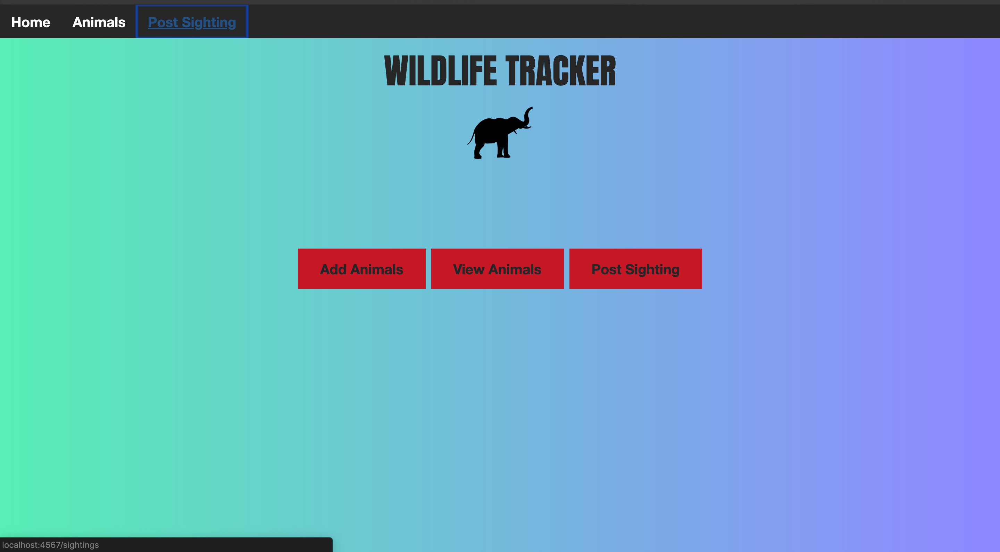
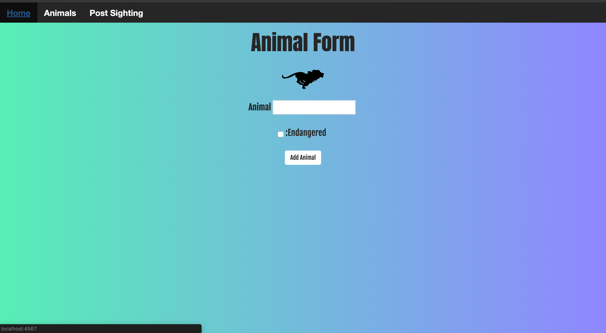
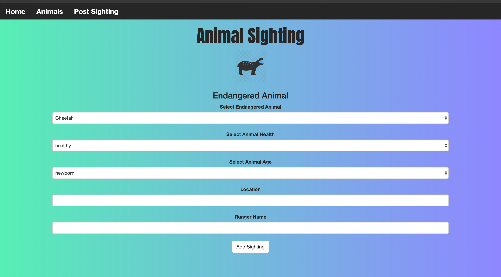
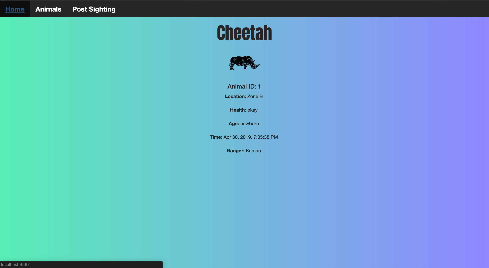

# WildlifeTracker
This program allows Rangers to track wildlife in a particular area and post the sightings

Version 1.0.0

# Contributors
Raymond Gitonga

## Description and Usage
This program uses spark forms,velocity template engine to allow rangers to add animals to there animal database, the rangers 
choose to group the animals as endangered and non endangered animals. Among the endangered animals the prograp allows the rangers
to post sightings and details of the sighting such as the location of the sightng, who sighted the animal, the age and health of
animal sighted

### This is the homepage of the website, it lets you choose whether you want to add an animal, view the animals or post a sighting

### Here the website allows you to add an animal to the website and choose whether it is endangered or not

### Here the website allows you to post sighting details of the animal

### Here the website allows you to view the sighting details of the animal

## BDD
|Behaviour   	|  Input  	|   Output	|   	
|---	|---	|---	|
|Add animal  	|Add animal to your databse and choose whether it is endangered or not|Animal created and added to list|   	
|Add animal sighting details	|Add details such as health age and sighting locations|Animal sighting details added|  

## Setup Installation Requirement
To access this project, you will need to access it from github then clone it.
Then run 'git clone https://github.com/raymondleta/WildlifeTracker' on your terminal

## Technologies Used
1. Java
2. Spark Micro-framework
3. Velocity Template Engine
4. CSS
5. SQL

### Support or questions
For any questions feel free to contact me through gitongaraymondd@gmail.com

## License 
MIT 2019
Raymond Gitonga
